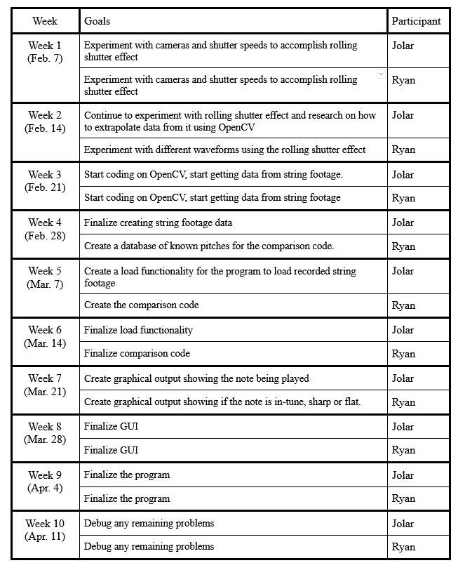

# VisualBasedGuitarTuner
COMP 4102 Final Project - Visual Based Guitar Tuner

## Team Members 
- Jolar Tabungar (101030060)
- Ryan Tordesillas (101041626)

# Summary
The purpose of this project is to identify the pitch of a guitar string when recorded using the rolling shutter effect. Using the effect will allow the frequency of the string oscillation to be identified and matched to a certain pitch, assisting the user in each string.
# Background
There are various videos of people playing guitar being recorded and leveraging the rolling shutter effect, creating the effect of clear wave patterns on the guitar strings. These wave patterns are created by the rolling shutter effect in the same way rapidly spinning objects appear warped in recorded videos (See video links at the end of the proposal).  By reading these waveforms, it is possible to identify a guitar string’s pitch and thus, be used to tune the guitar. 
# The Challenge
A major challenge with this project will be to get an accurate wave pattern to analyze using the rolling shutter effect. There are several factors that will affect the results such as lighting conditions, shutter speeds, capture frame rates, etc. The main factor in getting the desired wave pattern on the guitar strings will be the shutter speed; without the optimal shutter speed, the string will have no discernable wave pattern to analyze. However since adjusting the shutter speed affects the amount of light exposure the camera receives, lighting conditions will play a major role in getting the desired results as well. Experimenting through trial and error will be necessary in order to determine the right conditions in producing the effect reliably. It may also be necessary to experiment with different cameras and frame rates to achieve the desired results.

The next challenge, once ideal results are produced with the rolling shutter effect, is to then use OpenCV to analyze the recorded wave pattern and match it to the corresponding pitch. Using the recorded footage, it will be necessary to apply a gaussian high pass filter in order to isolate the wave pattern from the recordings. By recording the wave patterns of strings with known pitch, it is possible to build a database of wave patterns with their corresponding pitches. Once, we have sufficient data, the program must then match recorded wave patterns and match and compare them to its database to determine the pitch of the guitar strings. With a sufficient database, it should be able to determine the pitch of the string and determine how flat or sharp it is compared to the nearest correct pitch.

# Goals and Deliverables
The firstmost goal of the project is to determine the pitch of a guitar string by isolating the wave pattern created when guitar strings are recorded using the rolling shutter effect.
This will require determining optimal video recording conditions to create the clearest wave pattern. The next goal is to create a program to take recorded footage and isolate the wave pattern using a gaussian high pass filter. This program will make use of a database that we will construct using wave patterns of known string pitches. The program should reference this database to compare a given wave pattern and match it to a known pitch. It should also be able to match sharp and flat pitches to the nearest known pitch. The goal is to be able identify bass guitar pitches first, then hopefully continue with guitar, the concepts are similar, they will just require different database sets of wave patterns. In terms of constructing the wave pattern database, the goal is to save the wave patterns of each string within 5 semitones of that string’s pitch in standard tuning ; E-A-D-G for bass guitar. If time permits, we hope to add more data by recording the wave patterns of pitches in between the semitones.

The plan is to run the visual based tuner as a desktop application and analyze pre-recorded string footage. If there is time, we hope to add the feature of live feed analysis, making use of a camera connected to the computer. The next logical step would be to convert the desktop application into a mobile application.

In order for the project to be a success, we will require a video proof of the application running with a user interface showing the isolated wave pattern analyzed from the footage, as well as the pitch of the identified wave pattern and visual aid to indicate if the string is close to a known pitch (if it is flat or sharp).

Additionally, the accuracy of the application can be evaluated via side by side comparison to an audio-based tuner. The application will be determined to be highly successful if it can determine a string’s pitch as accurately as an audio-based tuner. 

Realistically, it is possible to create the desktop application version of the visual-based tuner which will match pre-recorded string footage to its corresponding pitch and/or determine the closest known pitch. It is unlikely that live video feed analysis and the mobile application conversion will be achievable in the project’s time period. Mobile application development is beyond the scope of this course, but it would be the ideal medium to host the application when coupled with live video feed analysis, as a mobile application would be better suited to use when tuning a guitar.

#Schedule
